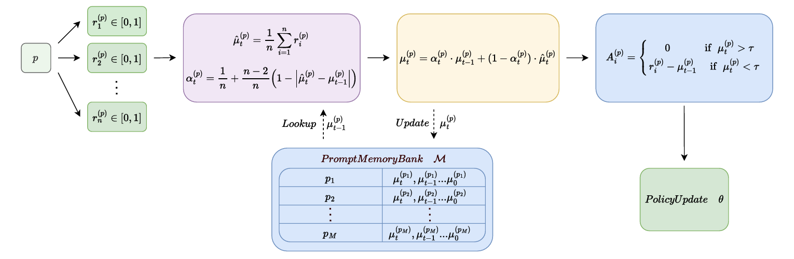

# MemPO: Memory-Augmented Policy Optimization

**Mitigating Catastrophic Forgetting in GRPO via Cross-Step EMA Normalization and Mastery Filtering**



## Overview

MemPO (Memory-augmented Policy Optimization, internally developed as EMA-GRPO) addresses a critical failure mode in Group Relative Policy Optimization (GRPO): **catastrophic forgetting of mastered problems during extended reinforcement learning training**.

### Core Idea

Standard GRPO normalizes advantages using per-batch statistics, leading to:
1. High-variance advantage estimates (especially with binary 0/1 rewards)
2. Destructive gradient updates on already-mastered problems
3. Insufficient learning signal on hard problems

MemPO introduces a lightweight **PromptMemoryBank** that maintains per-prompt exponential moving average (EMA) statistics across training steps, with three key innovations:

- **Parameter-free Dynamic Alpha**: `α_t(p) = 1/n + (n-2)/n · (1 - |μ̂_t - μ_{t-1}|)` — automatically adapts EMA smoothing based on policy change speed
- **Mastery Filter**: Zero-gradient protection when EMA mean exceeds τ = (n-1)/n, preventing harmful updates on mastered content
- **No Std Normalization**: Following Dr. GRPO, advantage = r - μ_EMA (no division by std), reducing baseline variance ~10x

## Repository Structure

```
verl/verl/                               # Modified verl framework source (for reproduction)
├── trainer/ppo/core_algos.py            #   EMA_GRPO advantage estimator
├── trainer/ppo/ray_trainer.py           #   Memory bank lifecycle & pre-init
├── trainer/config/algorithm.py          #   AlgoConfig with EMA-GRPO fields
├── trainer/config/ppo_trainer.yaml      #   Default YAML config
├── trainer/main_ppo.py                  #   Training entry point
├── utils/prompt_memory_bank.py          #   Core: per-prompt EMA statistics bank
└── experimental/dataset/
    ├── sampler.py                       #   AbstractCurriculumSampler interface
    └── degradation_sampler.py           #   Degradation-aware replay sampling (optional)

scripts/
├── train_example.sh                     # Full training script (GRPO baseline + EMA-GRPO)
└── eval_example.sh                      # Evaluation script

tools/
├── precompute_memory_bank.py            # Offline memory bank pre-initialization
└── eval_passk_final.py                  # Pass@k evaluation with vLLM

paper.tex                                # Paper draft
verl_modifications_current.md            # Detailed integration documentation
```

## Reproduction

### Prerequisites

1. Install [verl](https://github.com/volcengine/verl) framework
2. Patch the modified files into your verl installation:
   ```bash
   cp -r verl/verl/* /path/to/your/verl/verl/
   ```
3. Prepare dataset with `index` field in `extra_info`:
   ```python
   # Each row's extra_info must contain: {"index": <int>, "split": "train"}
   ```

### Training

```bash
python3 -m verl.trainer.main_ppo \
    algorithm.adv_estimator=ema_grpo \
    algorithm.pre_init_memory_bank=true \
    actor_rollout_ref.rollout.n=8 \
    ...
```

See `scripts/train_example.sh` for a complete training command, and [verl_modifications_current.md](verl_modifications_current.md) for full integration details.

### Key Hyperparameters

| Parameter | Default | Description |
|-----------|---------|-------------|
| `rollout_n` | 8 | Determines dynamic α range [1/n, (n-1)/n] and τ = (n-1)/n |
| `pre_init_memory_bank` | true | No-grad rollout init before training |
| `ema_warmup_steps` | 1 | Safety fallback for cold-start |
| `kl_gamma` | 0.0 | Reactive KL penalty (disabled by default) |
| `mastery_soft_alpha` | 0.0 | Soft mastery weighting (disabled by default) |
| `degradation_gamma` | 0.0 | Degradation-aware resampling (disabled by default) |

## Method Details

### Dynamic Alpha (Parameter-Free)

| Scenario | δ = \|μ̂_t - μ_{t-1}\| | α | Interpretation |
|----------|-------------------|---|----------------|
| Large policy shift | δ → 1 | α → 1/n | Trust current batch (baseline is stale) |
| Stable policy | δ → 0 | α → (n-1)/n | Trust history (smooth baseline) |

For n=8: α ∈ [0.125, 0.875], no manual tuning required.

### Mastery Filter

When the updated EMA mean μ_t > τ = (n-1)/n:
- Forces advantage = 0 (zero gradient)
- Prevents wasteful/harmful updates on already-solved problems
- Uses μ_t (not batch mean) to avoid false triggers from lucky batches

### Pre-initialization

Before training, runs a no-grad rollout pass over all training prompts to initialize μ₀, eliminating cold-start artifacts.

## License

Apache License 2.0
